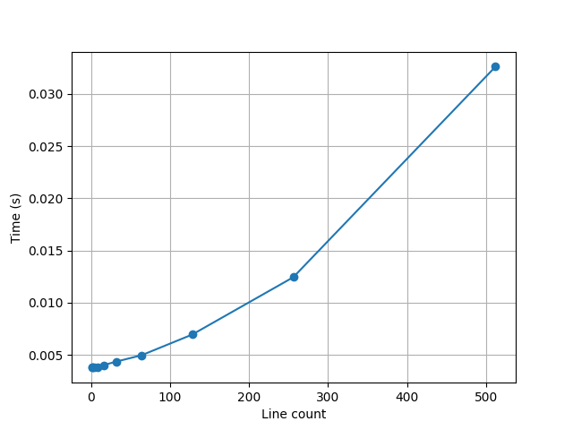

# Hešavimo funkcija

## Rekvizitai

- C++ kompiliatorius, palaikantis C++17 standartą
- CMake

## Algoritmo idėja
* Funkcija paima std::string ir grąžina 64 simbolių heksą (32 baitai).
* Input/Output: tekstas → mažosiomis raidėmis heks reikšmė.
- ### Pipeline
* iš input'o sudaro 64‑baitų bloką (trūkumą pildo expand)
* sukeičia 32‑baitų puses
* atlieka ~70k bitų keitimų   (content_swapper), 
* „suglaudina“ perteklių į pirmus 32 baitus (collapse)
* grąžina heksą.

## Paleidimas

`# Unix/MacOS`
- `mkdir -p build/`
- `cmake ..`
- `cmake --build .`
- `./main [--input <input>  [--salt <salt>]]| --file <file_path>]`

`# Windows(netestuota, ymmw)`
- `dir build/`
- `cd build/`
- `cmake ..`
- `cmake --build .`
- `main.exe [--input <input> | --file <file_path>]`

`# Pavyzdys`
- `./main --input a`
- `./main --file ../konstitucija.txt`
- `./main --input a --salt asndiasdas`
## Testų sugeneravimas

Norint sugeneruoti testus, reikia paleisti šią komandą:

- `./main generate`

## Testavimas

Norint testuoti, reikia naudoti šią komandą (reikia turėti sugeneravus failus prieštai):
- `./benchmark`

atlikus testavimą, galima sugeneruoti konstitucijos nuotrauką su:

- `./draw_konstitucija`

pavyzdys:

## Rezultatai

## Konstitucijos testas

Gauti rezultatai:

| 1   | 0.000587  |
|-----|-----------|
| 2   | 0.0005952 |
| 4   | 0.0006158 |
| 8   | 0.0006594 |
| 16  | 0.000819  |
| 32  | 0.0010494 |
| 64  | 0.0015554 |
| 128 | 0.0030648 |
| 256 | 0.006121  |
| 512 | 0.013614  |

Manau sąlyginai neblogai veikia.
## Avalanche
Šita implementacija veikia tikrai labai blogai. Dažnai hash'ai sutampa atliekant avalanche efekto eksperimentą.

100 simbolių 100'000 stringų porų rezultatai:

| type | avg   | max | min |
|------|-------|-----|-----|
| Hex  | 92.62 | 100 | 0   |
| Bit  | 49.75 | 100 | 0   |

## Colision
Collision testai atnešė geresnius rezultatus -- kolizijų nė karto nepasitaikė.

## Išvados

Algoritmą reikia tikrai labai tobulinti. Labai svarbu išsiaiškinti kaip užtikrinti, jog vieno simbolio pakeitimas užtikrins viso hash'o pakitimą.